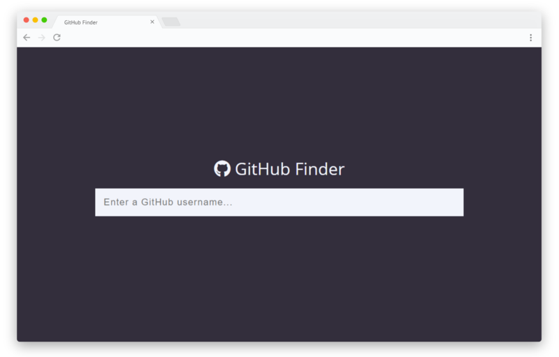

<div align="center">
  <h1>GitHub Finder</h1>

  <h3>Search GitHub users and get the profile info and the latest repos</h3>

  
</div>

<br>

<div align="center">
  <h2>Used technologies</h2>
  
&nbsp;&nbsp;
  
&nbsp;&nbsp;
  
&nbsp;&nbsp;
  
&nbsp;&nbsp;
  
&nbsp;&nbsp;
  
</div>

## Project Setup

### Prerequisites

Install the _latest version_ of [Node.js](http://nodejs.org)

### Project Install

To grab the project, either Fork this repo or [click here to download](https://github.com/arongordos/github-finder/archive/main.zip) the `.zip` folder and extract the files wherever you like on your machine.

#### Step 1: Package Manager

To install the project dependencies, you will need to use `npm`.

#### Step 2: Project Dependencies

Now, you can install the project dependencies by running:

```
npm install
```

#### Step 3: Running the project
The project is built using `webpack-dev-server`.

To start the project, run:

```
npm start
```

<br>

<div>
  <h2>Screenshots</h2>
  
  
</div>
